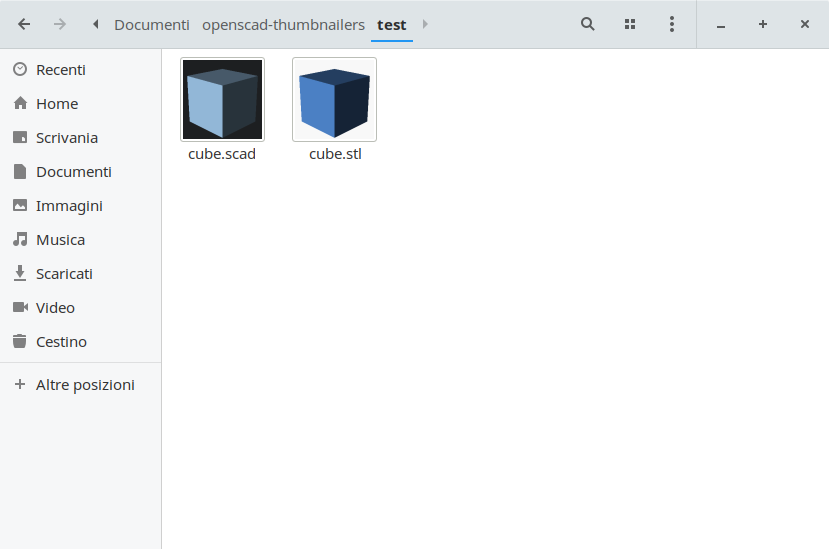

# Openscad thumbnailers

This project allows Nautilus (and a number of other file managers) to show thumbnails for `.stl` and `.scad` files.

**Openscad and sudo are required**

To install, open a terminal into this directory and execute `./install.sh`.